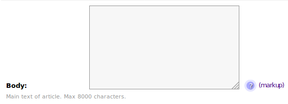

# TML
A reliable markup language with the essentials for HTML typography. Fast to type and memorable. Includes optional UML, for unicode shortcuts.

This app is called django-tml, but internally the module is called 'tml'.

## Why you may not want this app
Where people don't use [Markdown](https://www.markdownguide.org/basic-syntax/), they use [reStructuredText](https://www.writethedocs.org/guide/writing/reStructuredText/). This is the only current implementation of TML. And this version is deliberately a web/HTML tool. TML is a very flexible language, but this app will not generate academic-level citations.

## Why you may be interested
Like me, you feel markup is essential, interesting, but don't want to spend time on it.

## Overview
The main code in the package is a parser. There are also some small pieces of support code. In 'tml/io' is a snippet to feed and present the parser in a suitable way for all kinds of code, not only Django. And a few template tags.

There is a basic attitude for use in Django which is, if users send markup, code should save markup. So there is no code for a transforming 'TML field'. If this bothers you, run a lazy conversion somewhere and cache. There are many ways to do that, and the web itself does that too.

## If you have done this before
- install
- pick or create a TextField for TML storage.
- Add the template tag to the rendering of the textfield

### Install
PyPi,

    pip install django-tml

Or download the app code to Django.

If you do not need the Django integration, you do not need to install. Otherwise, declare in Django settings,

    INSTALLED_APPS = [
        'tml.apps.TmlConfig',
    ]

No migrations needed.

## Template tags
Most of the time, this is all you need. Assuming a model called Page, with a TextField called 'text' holding the main body of text, in a template,

     
     ...
            
     {{ page.text|tml }}

Done. Any TML code posted into the field becomes converted to HTML on rendering.

### Other template tags
This will run the unicode converters,

     {{ page.text|uml }}

This runs the HTML generation of TML, followed by the Unicode conversion of UML,

     {{ page.text|uml_tml }}

This runs the TML and UML converters, and converts 'pre' areas into codeblocks configured for the code highlighter [prismjs](https://prismjs.com/),

     {{ page.text|tml_uml_prism }}

Yes, you can create a parser for your choice of code-highlighter in a few lines. You need a Parser override to generate the HTML. Look at the code in 'tml/parser.py'. Then you need a template tag. Look at the code in 'tml/templatetags/'.

## View-context conversion
If you are looking at TML semi-permanently, you could convert in a View context. Seems rather involved, but will spare you a template tag. The code to use will depend on the source data and the target template, but something like,

    import tml

    def get_context_data(self, **kwargs):
        ctx = super().get_context_data(**kwargs)
        obj = kwargs['object']
        ctx['content'] = tml.html(object.body)
        return ctx

This, at least, demonstrates how to convert in open code.

## Details of operation
### IO
The code in 'tml/io.py' is worth mentioning. It shows how to handle the parser.

The Parser is a feed parser. It does not take a 'source', it accepts a feed of lines, and needs a builder for output. The lines must be in a particular form, stripped of trailing newlines. This can be done using a io.StringIO object, which can normalise the line-ends then feed lines as chunks.

### Escaping
Current attitude of the support code is to trust input, but escape 'pre' formatted areas for code display. I can see cases where you may wish for more or less escaping. We shall see.

## Form support

### The widget
A form widget for TextFields that contains a simple button-click-for-help. Please note this widget will not transform TML into HTML. 

It only adds a help button.

You can do a quick override in an admin field,

    from django.db import models
    from tml import TMLTextarea
    ...
            
    class FireworkAdmin(admin.ModelAdmin):
        fields = ('title', 'slug', 'body', 'author')
        ...
        formfield_overrides = {
            models.TextField: {'widget': TMLTextarea},
        }
    
NB: if used in admin, the button is positioned to the right. But in other forms it can be positioned elsewhere.
        
    
## TML Intro
TML output usually paragraphs everything.

It would take pages of spec to cover the ins and outs of TML. But here is a short into to this reduced version.

Control codes are placed hard left in text. These are followed by a tagname, then closed by a repetition of the control code. These 'block' codes correspond to HTML 'structural' tags,

    #div
    This is inside the div
    #

There are shortcuts made by repeating the control code,

    ##
    This is inside a div
    #

There is also an inline tag. This can also be followed by a tagname, The tagname must be followed by a space or spaces to the enclosed text. This 'inline' control corresponds to HTML 'phrase content' tags,
 
    So [cite this is inside] a citation tag.

There is a shortcut made by omitting the control code,

    So [ this is inside a span] followed by other text

I give up. Try pasting this into a TML field,

    #article

    = About TML
    == h2 headline
    === h3 headline
    ==== etc.
    Newlines are reduced to spaces, like in TeX. 
    That's not all.

    Like TeX, two newlines make a paragrah break.

    >>
    blockquote
    >

    ++
    - List item
    - List item 2
    +

    +dl
    ~ term 1
    : definition 1
    ~ term 2
    : definition 2
    +

    If you only need one line list elements, lists can be anonymous
    - item 1
    - item 2
    - item 3

    And finally, a couple of useful tricks [a(https://www.etymonline.com/) like an anchor]. 

    And if you use the Prism parser, the 'pre' block is tricked into being a codeblock, and the tagname tricked into the language specifier. Like this,

    ?python
        c = a + b
    ?

    You do neet to link the webpage to the [a(https://prismjs.com/) prismjs] code to make the code in the tags highlight.
    #

## UML Intro
UML is a small set of conversions from keyboard-accessible codepoint sequences into inaccessible-but-useful-or-common codepoints. For example, it can turn shortcut inverted commas into open/close curly inverted commas. It can render a copyright sign etc.  

Some people don't believe in doing this, for reasons I can't argue with. On the other hand, 19 out of 20 computer users can't find a copyright symbol. That's my excuse.

Have a look at the uUML file for full details (of a somewhat reduced implementation). Or paste the following sentence into a textield rendered by a UML template tag,

    So ''this' will generate curly quotes, as ""this" will generate curly double quotes, '---' makes an em-dash, '(c)' makes copyright, and this '110:mo' will record your temperature as running at 110 degrees.

